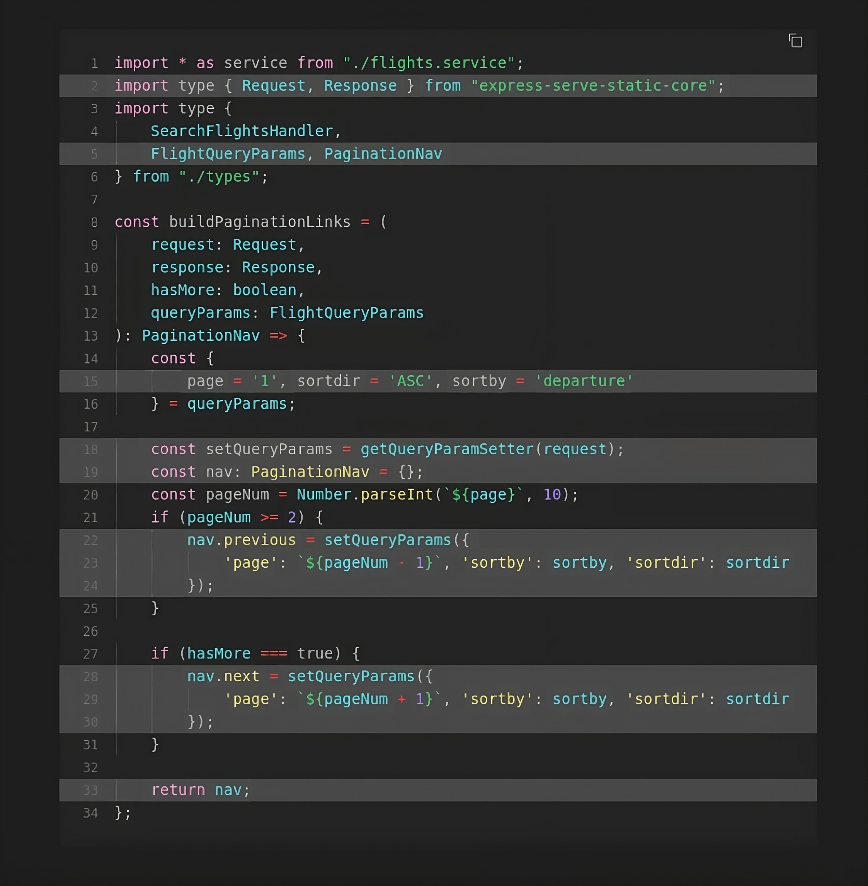
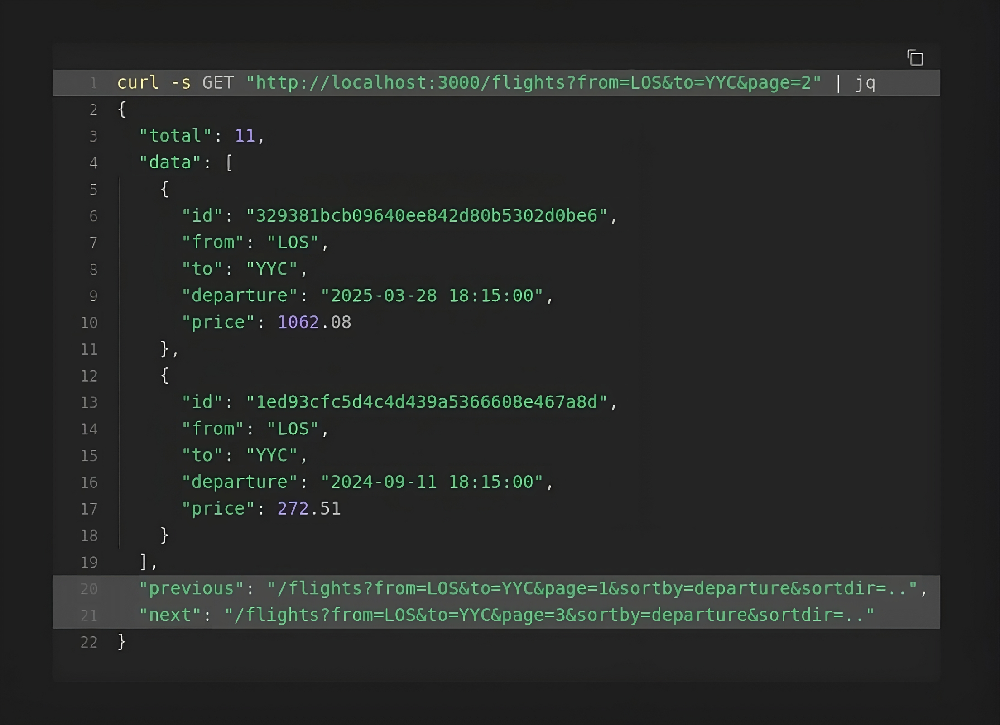
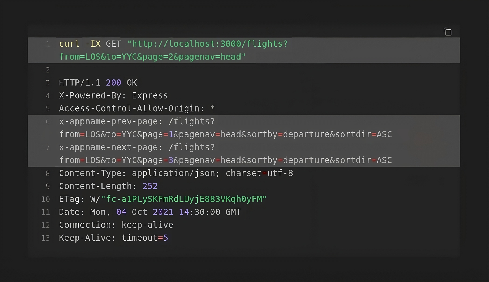

## Pagination Nav Links Express APIs

I'd like to show you a simple but functional way generate next/previous pagination links in an Express API controller, using modern TypeScript techniques and built-in types.

Read the [full tutorial](https://chalu.hashnode.dev/simplifying-api-client-development-with-automated-pagination-links-in-rest-apis) for more details.

