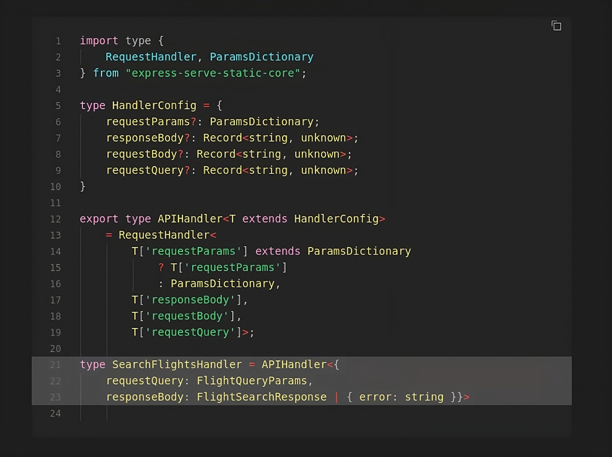
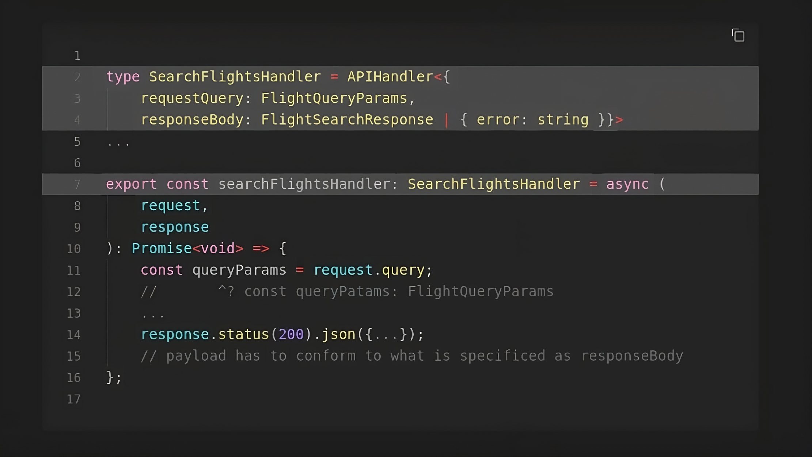

# Typed Express API Handlers

I'd like to show you a cool but effective and developer friendly way to properly type the `request` and `response` objects in an Express API controller, using modern TypeScript techniques and built-in types.

> See it live using [github.dev](https://github.dev/chalu/tutorials-src/blob/main/typed-express-handlers/src/flights.controller.ts)

> Read the [full tutorial](https://chalu.hashnode.dev/a-modern-developer-friendly-approach-to-typed-express-api-handlers-with-typescript) for more details.

